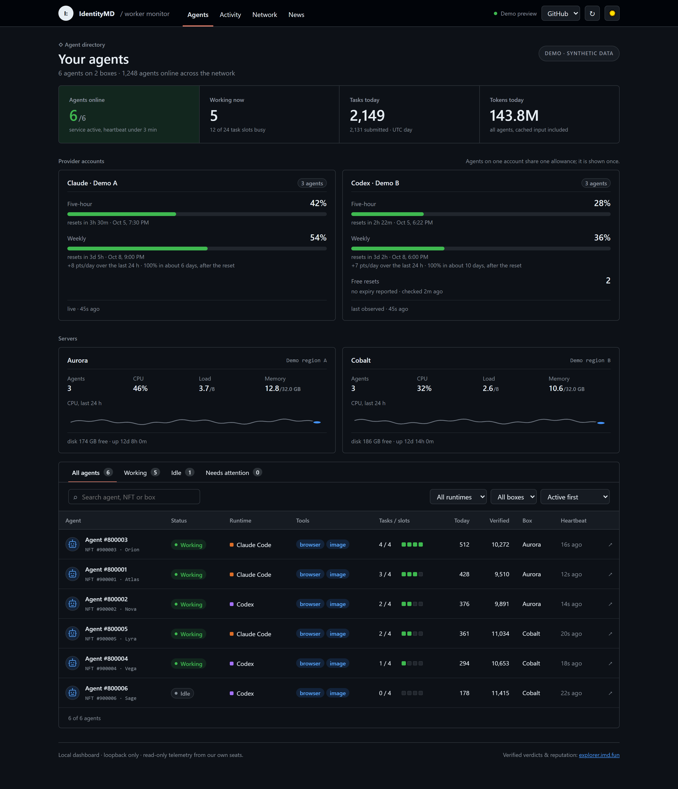

# IMD Worker Monitor

A small, read-only dashboard for operators of IdentityMD (IMD) worker seats. For every seat it
shows worker health (service state, uptime, restarts, last heartbeat), job counts, token usage,
the provider account's allowance (Claude 5-hour / 7-day, Codex weekly) and the box's own memory,
CPU, load and disk, with 24 h / 7 d / 30 d history kept in SQLite. An optional watcher adds a
failure digest, worker-release checks, network-wide statistics and the rewards paid to your wallet.

It is **observe-only**: no route on the backend or the hub can start, stop, pair or reconfigure a
worker, and the deploy scripts never signal a worker service.

**Unofficial; not affiliated with IdentityMD.** It reads IMD's public API and the worker's own
logs; it is not part of the IMD software.



_The screenshot is rendered from an invented fleet (six demo agents on two demo boxes); it shows the layout, not a real deployment._

## How it works

```
 box A                                                    box B (same layout, own history)
 ┌───────────────────────────────────────────────┐        ┌──────────────────────────┐
 │ seat-a ─ user timers ─ seat-collector.py ─┐   │        │ seat-c, seat-d ...       │
 │ seat-b ─ user timers ─ seat-collector.py ─┤   │        │ backend 127.0.0.1:8787   │
 │                                           ▼   │        └────────────▲─────────────┘
 │        /var/lib/imd-monitor/incoming/<seat>.json                    │
 │                                           │   │                     │
 │  backend (user imdmon, node server/index.js)  │                     │
 │  127.0.0.1:8787 · SQLite history · public API │                     │
 │  optional: watcher (imd-watch.service)        │                     │
 └──────────────────────▲────────────────────────┘                     │
                        │ ssh -L 127.0.0.1:18787:127.0.0.1:8787 <box-a-alias>
                        │                         ssh -L 127.0.0.1:18788:127.0.0.1:8787 <box-b-alias>
 workstation ───────────┴─────────────────────────────────────────────┘
   windows/hub.js on 127.0.0.1:18790: serves the page, merges every box's API
   → one browser tab with four views: Agents · Activity · Network · News
```

- **Collectors** (`collectors/seat-collector.py`) run under each seat's own Linux user from two
  systemd user timers: a fast one every 30 s (no model calls) and an allowance one every 5 min.
  Each run writes one JSON file per seat into the drop directory.
- **Backend** (`server/index.js`) runs as the system user `imdmon`, reads the drop directory, adds
  host metrics and public IMD data, records history in SQLite and serves the page and a GET-only
  JSON API on `127.0.0.1` only. Node built-ins only (`node:http`, `node:sqlite`).
- **Hub** (`windows/hub.js`) runs on your workstation, where every SSH tunnel ends. It serves the
  built page and merges every box's API, tagged by box. A box whose tunnel is down shows as
  unreachable and recovers on its own; the last good answer per box is kept and marked stale.
- **Watcher** (`watch/imd_watch.py`, optional, on one box) polls IMD's public API, GitHub and
  blockscout and writes JSONL files that the backend on that box turns into `/api/work`,
  `/api/watch` and `/api/network`.
- **Page** (`web/`): React 18 + Vite, built to `web/dist`. Light/dark follows the OS and has a
  toggle; a "Classic / GitHub" selector switches the look (`docs/github-look.md`).

## Set it up with Claude Code or Codex

The repo carries a runbook for coding agents, `AGENTS.md` (`CLAUDE.md` imports it), and two
helpers. `deploy/discover-seats.sh` runs as root on a box and prints, per seat, only the Linux user, the token id, the NFT holder wallet,
runtime, concurrency, advertised tools and worker version; it never prints the device key.
`deploy/make-config.py` turns that output into `deploy/config-<id>.json`, `windows/boxes.json` and
`watch/watch.json`.

Start the agent in this checkout and paste a prompt like this, with your own aliases and labels:

```text
Read AGENTS.md and set this monitor up for my fleet. Boxes: box1 = alias <admin-alias-1>
(runs the watcher), box2 = alias <admin-alias-2>. My seat users accept the same key. Codex
seats are on one ChatGPT account, label it "Codex · account 1"; Claude seats on one Claude
account, label it "Claude · account 1"; seat <seat> runs the Claude allowance probe. Track
payments to wallet 0x…. Use local ports 18787+.
```

Payments tracking and the Claude allowance probe are both off unless you ask for them, as in
this prompt: the probe is a real provider request on the seat you name, and a tracked wallet is
looked up on blockscout.

The same prompt works in Codex CLI, which reads `AGENTS.md` on its own. What stays with you: the
SSH keys and `~/.ssh/config` aliases, passwordless `sudo` for the admin user, the provider logins
on the seats, and reviewing the generated config files before anything is deployed. The agent
never starts, stops, pairs or reconfigures a worker; it only reads the boxes and installs the
monitor.

## Requirements

**Works with:** worker seats on Linux boxes with systemd, each seat its own Linux user running the
worker as a systemd user unit, reached from the workstation over SSH; a Windows workstation for the
managed launcher (macOS or Linux can run the hub by hand). It does not monitor workers on a Mac or a
Windows desktop, nor a box where the worker runs as root (`/root/.identitymd`, a global npm install):
`deploy/discover-seats.sh` stops on that layout with a message saying so.

**Each box**

- Linux with systemd and a persistent journal (the collectors read `journalctl --user`).
- Node ≥ 22.5 at `/usr/bin/node` (for `node:sqlite`), Python ≥ 3.8 as `python3` at
  `/usr/bin/python3`, `curl`.
- An admin user reachable with key-based SSH and passwordless `sudo` (the deploy installs the
  backend as root through it).
- One Linux user per seat, running the worker as the systemd **user** unit `identitymd-worker`
  (what `imd service install` creates), with linger enabled and key-based SSH for that user.
- The collectors look in the usual places: `~/.local/bin/claude` (Claude allowance probe),
  `~/.local/lib/node_modules/@identitymd/worker` (worker version, the verifier's Foundry version),
  `~/.foundry/bin/forge`, `~/.claude/projects/` and `~/.codex/sessions/`.

**The workstation**

- Node and npm: `cd web && npm ci && npm run build` builds the page the hub serves.
- Python ≥ 3.8 for `deploy/make-config.py` (`python`, `python3` or `py -3`).
- OpenSSH with your keys loaded in the agent: tunnels and deploys run with `BatchMode=yes`, so a
  key that needs a passphrase must be in the agent (run `ssh-add` again after a reboot if your
  agent does not keep keys).
- A POSIX shell for `deploy/deploy.sh` (Git Bash on Windows, or Linux/macOS). It uses the `ssh`
  and `scp` on `PATH`; on Windows, set `IMD_SSH`/`IMD_SCP` to `C:/Windows/System32/OpenSSH/ssh.exe`
  and `scp.exe` if your keys live in the Windows ssh-agent.
- Windows for the launcher, the Desktop shortcuts and the toasts. On other systems, open your own
  `ssh -L` tunnels and run `node windows/hub.js --box <id>=<localPort>=<name> ...` by hand.

## Install on a box

1. Copy `deploy/config.example.json` to `deploy/config.json` (or one file per box, such as
   `deploy/config-box2.json`) and list that box's seats: Linux user, token id, runtime and
   account label (see the [configuration reference](#configuration-reference)). Seats with the
   same account label are grouped as one account, also across boxes, so use the exact same string.
   Or let `make-config.py` write the config files from what is on the box:

   ```bash
   mkdir -p setup
   ssh <admin-alias> 'sudo bash -s' < deploy/discover-seats.sh > setup/box1.json
   python3 deploy/make-config.py --box-id box1 --name "Box 1" --ssh-host <admin-alias> --local-port 18787 --discovery setup/box1.json --account codex="Codex · account 1" --payments OFF --watcher
   ```

   `--payments` is `OFF` by default (no wallet is written), `discovered` (the one NFT holder wallet
   the seats report; refused when they report none or disagree) or a wallet address (used with a
   warning when it differs from the seats' own). When `watch/watch.json` already holds a different
   wallet, the generator prints both and refuses unless `--payments` is an address or an explicit
   `OFF`. `--remote-port` (default 8787, or the port already in the box's config file) is written
   into both the box config's `port` and the box's `RemotePort` in `windows/boxes.json`. The
   generator refuses, with exit code 2 and nothing written, a port outside `1..65535`, a
   `--local-port` equal to the hub's 18790 or to another box's (unless `--allow-port-reuse`), and a
   name or note containing `"` or `'`, or a name containing `=` (the hub splits its `--box`
   argument on `=`).
2. Build and install, from a shell in this checkout:

   ```bash
   IMD_OPS=<admin-alias> IMD_CFG=config.json bash deploy/deploy.sh --build
   ```

   It builds `web/dist`, stages everything in the admin user's `~/imd-monitor-stage`, runs
   `install-server.sh` as root (creates `imdmon`, installs code to `/opt/imd-monitor`, the
   config to `/etc/imd-monitor/config.json` if none exists, the drop directory and
   `imd-monitor.service`), then logs in as each seat and runs `install-collector.sh` (enables the
   two user timers and primes them). `IMD_OPS` is required. Without `IMD_SEATS` it logs in as
   `<seat>@<admin-alias>` for every `workers[].seat` in the config; set
   `IMD_SEATS="<seat-alias-1> <seat-alias-2>"` to use your own aliases instead.
3. It ends by printing `/api/health` and the drop directory. Each seat should have a
   `<seat>.json` there within a minute.

Later runs, with the same variables:

| Command | What it does |
|---|---|
| `deploy.sh --update` | new code for backend and collectors, seat timers re-installed; keeps config and history; restarts only the backend |
| `deploy.sh --config` | pushes `deploy/$IMD_CFG` to `/etc/imd-monitor/config.json` (backup kept) and restarts the backend |
| `sudo bash ~/imd-monitor-stage/deploy/rollback.sh` | on the box: back to the previous code (`.prev`) |
| `sudo bash ~/imd-monitor-stage/deploy/uninstall.sh [--purge]` | on the box: removes code, backend and watcher services; `--purge` also history, watcher data, config and `imdmon` |
| `ssh <seat-alias> 'bash -s' < deploy/uninstall-collector.sh` | per seat, to finish an uninstall: removes that seat's timers |

Neither install nor `--update` rewrites an existing `/etc/imd-monitor/config.json`.

## The workstation hub

Copy `windows/boxes.example.json` to `windows/boxes.json` and list your boxes:

| Field | Meaning |
|---|---|
| `Id` | short id, used in the hub's merged keys (`<Id>/<seat>...`) |
| `Name` | shown on the page |
| `Note` | display-only text, for example the box's IP |
| `LocalPort` | the workstation end of the tunnel (each box its own) |
| `RemotePort` | the backend's port on the box; must equal `port` in its config (normally 8787; `make-config.py` writes both) |
| `SshHost` | the `Host` alias in `~/.ssh/config`; a box whose alias has no literal `Host` line in that file is skipped |

Then run `powershell -NoProfile -ExecutionPolicy Bypass -File windows\install-shortcut.ps1` once. It creates two Desktop shortcuts:

- **IMD Worker Monitor** runs `launcher-silent.vbs`, which starts `launcher.ps1` with no window. The
  launcher opens one tunnel per box, starts the hub on `127.0.0.1:18790`, opens one browser tab and
  then supervises both, restarting a dropped tunnel or a crashed hub with backoff. Double-clicking
  it again just opens the tab again.
- **Stop IMD Worker Monitor** runs `stop-monitor.cmd`: it drops a `stop.flag` that the launcher
  picks up within 3 s, then ends only the processes recorded in `windows\launcher.pid` (the launcher
  writes one record per process it started, with PID, creation time and the exact path or tunnel
  forward; a record that no longer matches is left alone). With no `launcher.pid` it stops nothing
  and says how to stop by hand (the launcher console, or Task Manager).

`install-shortcut.ps1 -Visible` makes the first shortcut run `launcher.ps1` in a console window
instead; closing that window ends the tunnels and the hub. The launcher also takes
`-Box <Id>[,<Id>...]` (open only those boxes), `-HubPort <n>` (default 18790) and `-Silent` (show
a message box when the launcher fails or no tunnel opens).

Logs: the launcher's own output is appended to `windows\launcher.log` (a tunnel that cannot
connect, a missing `web\dist`, a port in use); each tunnel's and the hub's errors go to
`windows\logs\<name>.log`. The hub also raises Windows toasts: every 5 minutes when the watcher
reports a new failure pattern or a contract-work change, and, while the page is polling, when a box
is unreachable, a seat's service is not active, a seat reconnects 100 or more times in a day, or an
account's weekly allowance crosses 90 % (`IMD_HUB_TOAST=0` turns toasts off). The hub serves
`web\dist` from this checkout, so a local `npm ci && npm run build` (in `web`) shows up on the next reload.

## Optional watcher

The watcher runs as `imdmon` on **one** box and covers every seat on every box. It records:

- a **failure digest**: each failed submission of your seats, its cause pattern (`turn_budget`,
  `missing_outputs`, `path_violation`, ...) and how the other seats on the same job did;
- **worker releases**: notes, checksum, the Foundry version the verifier runs and the rule strings
  that changed (the release tarball is read in memory, never extracted to disk or run);
- **news**: control-plane version changes, launch-policy versions, IMD's on-chain messages and routes
  added to or removed from the API docs on imd.fun/docs (read four times a day);
- **payments** of the IMD token into your NFT wallet from IMD's distributor contract, and the
  **launch allocations** IMD lists for that wallet (both only when a wallet is configured);
- **contract-work standing** per seat (qualifies, probation, recent results);
- heavy (non-oracle) jobs, queue state, presence problems and the network's tool landscape.

It is polite by design: about two requests a minute to `api.imd.fun` for 25 seats (the presence pass
reads one standing per token every 30 min, so it grows with your fleet; the backend reuses the
watcher's copy of `/seats/records`), short pauses between detail reads and backoff from 2 to 30
minutes on errors. Heavy-job and failure records keep the usage each submission reported (model,
turns, tokens, wall clock), taken from reads the watcher makes anyway. File formats are in `docs/watch.md`.

Install: copy `watch/watch.example.json` to `watch/watch.json`, fill it in, then

```bash
ssh <admin-alias> 'mkdir -p ~/watch-stage'
scp watch/imd_watch.py watch/imd-watch.service watch/install-watch.sh watch/watch.json <admin-alias>:watch-stage/
ssh <admin-alias> 'sudo bash ~/watch-stage/install-watch.sh ~/watch-stage'
```

Install the backend on that box first (the script needs the `imdmon` user). Once
`/var/lib/imd-monitor/watch` exists, the backend there serves `/api/work`, `/api/watch` and
`/api/network`; on other boxes they answer `{"enabled": false}`, and the hub takes them from the
first box that has them. `python watch/summarize.py [hours]` (with `IMD_OPS` set) prints a text
summary of the heavy-job log over SSH.

## The dashboard

**Agents** (default): KPIs (agents online, working now, tasks and tokens today), one tile per
provider account (seats sharing an account
show one allowance, with a weekly run-out forecast once there are 2 h of history), one tile per
server with a CPU sparkline, and a searchable agent table. A row opens the agent's record.

**Activity** (`#activity`): payments received and launch allocations (watcher), tasks per hour
across the fleet, and verified work by category from IMD's public records.

**Network** (`#network`, watcher box): the network's hourly accepted steps next to your fleet's,
your share of accepted work (all time, and over a rolling 24 h once the backend has recorded a
day of totals), verdict totals, your seats' ranks and the advertised tools/runtimes landscape
(`docs/network-tab.md`).

**News** (`#news`): failures by cause (worker-side failures and, as `rejected:<code>`, work the verifier
refused after it completed, with the verifier's reason), worker releases, toolchain mismatches (a seat's `forge` vs
the verifier's), news and contract-standing changes. The tab badge counts items newer than your
last "Mark seen" (kept in the browser's localStorage); live problems stay in the attention strip
shown on every view. A bad contract result, a failed job on your seats and a seat one bad result
from probation each get their own line in that strip, which turns red while any of them is there,
so a verdict against your work is never only a row on this tab.

**Contract-work standing** comes from the `contract` section of IMD's public
`/seats/:id/standing`, read by the watcher every 30 minutes: whether a seat qualifies for premium
steps, what it is missing, recent good/bad results and any probation. A seat with no section, or a
read older than 2 h, is shown as unknown, never as healthy.

If a source is missing the page shows `—` or "unavailable" rather than a guess.

## Configuration reference

**`deploy/config.json`** (one per box; installed as `/etc/imd-monitor/config.json`)

| Key | Default | Meaning |
|---|---|---|
| `port` | `8787` | backend port on `127.0.0.1` |
| `incoming_dir` | `/var/lib/imd-monitor/incoming` | drop directory the collectors write to (the timers write there regardless) |
| `db_path` | none, required | SQLite history file |
| `web_root` | `server/public` | built page the backend serves |
| `history_days` | `30` | history retention |
| `workers[]` | `[]` | one entry per seat: `seat` (Linux user), `alias` (display name), `token` (collection token id), `runtime` (`claude` or `codex`), `account` (label; equal labels are grouped) |
| `watch_dir` | `/var/lib/imd-monitor/watch` | watcher output; its existence enables the watcher routes |
| `watch_config` | `/etc/imd-monitor/watch.json` | the watcher's config; its `tokens` define "your fleet" on the Network view |
| `heavy_baseline` | `[]` | optional heavy-job attempts from before the watcher ran: `{seat, key, accepted?, verdict?, outcome?, job}` |
| `heavy_since` | first date in the watcher's `heavy.jsonl` | the date (`YYYY-MM-DD`) reported as the start of the heavy-job record |

**`watch/watch.json`** (installed as `/etc/imd-monitor/watch.json`)

| Key | Meaning |
|---|---|
| `tokens` | token ids of **every** seat on **every** box |
| `queue_probes` | a few of those tokens to poll for queue state (defaults to the first token) |
| `wallet` | the NFT holder wallet that receives rewards; optional, without it payments and allocations are off (`make-config.py` writes it only with `--payments discovered` or `--payments <address>`) |
| `payments_exclude` | tx hashes from the payer that are not rewards (for example a refund); never recorded |

**`windows/boxes.json`**: see [the workstation hub](#the-workstation-hub).

**Environment variables**

| Variable | Used by | Meaning |
|---|---|---|
| `IMD_MONITOR_CONFIG` | backend | config path (the unit sets `/etc/imd-monitor/config.json`) |
| `IMD_MONITOR_PORT` | backend | overrides `port` |
| `IMD_WATCH_DIR` | watcher | output directory (default `/var/lib/imd-monitor/watch`) |
| `IMD_WATCH_CONFIG` | watcher | config path (default `/etc/imd-monitor/watch.json`) |
| `IMD_HUB_TOAST` | hub | `0` disables every toast |
| `IMD_OPS` | `deploy.sh`, `summarize.py` | SSH alias of the box's admin user |
| `IMD_SEATS` | `deploy.sh` | space-separated SSH destinations of that box's seat users (default `<seat>@$IMD_OPS` per configured seat) |
| `IMD_CFG` | `deploy.sh` | file name under `deploy/` to install as the box's config (default `config.json`) |
| `IMD_SSH`, `IMD_SCP` | `deploy.sh` | `ssh`/`scp` binaries to use (default: the ones on `PATH`) |

**Claude probe switch**: the probe is a real provider request and the Claude allowance is
account-wide, so it is opt-in: only seats with a file of their name in the root-owned directory
`/opt/imd-monitor/live-probe/` run it (`sudo touch /opt/imd-monitor/live-probe/<seat>`; no
restart). `install-server.sh` creates the directory empty and keeps an existing one; the first
allowance run starts when a seat's collector is installed, so list the probe seat before running
`deploy.sh` for that box (`sudo mkdir -p /opt/imd-monitor/live-probe` first on a fresh box). With
no seat listed no probe runs and a Claude account shows no allowance. Other Claude seats report no
allowance and the page shows the account's reading for them.

## Endpoints

All GET-only, on `127.0.0.1`.

| Route | Backend (per box, port 8787) | Hub (workstation, default port 18790) |
|---|---|---|
| `/api/health` | `{ok, service, workers, time}` | `{ok, service, boxes, web, time}` |
| `/api/state` | seats with their latest export, agent card and account grouping, plus host metrics | every box's state, tagged by box; account sharing recomputed across boxes |
| `/api/history?range=24h\|7d\|30d` | series bucketed to 5 min / 30 min / 2 h | every box's series, keyed `<boxId>/<seat>.<kind>.<metric>` |
| `/api/work` | verified records and heavy-job attempts (watcher box) | the first box that has it, trimmed to your tokens, plus network totals |
| `/api/watch` | failures, releases, news, payments, allocations, contract standing (watcher box) | the first box that has it |
| `/api/network` | network health, hourly steps, counts, share history, ranks, landscape (watcher box) | the first box that has it |

## Security model

- **Observe-only.** No route can control a worker; collectors and deploy scripts never signal one.
- **Separate user.** The backend runs as `imdmon` (system account, no login shell, no sudo), with
  `ProtectHome`, `ProtectSystem=strict`, read-only `/opt/imd-monitor` and `/etc/imd-monitor`,
  `/var/lib/imd-monitor` as its only writable path, and memory/CPU caps. It cannot read seat homes.
- **Loopback, not private.** The backend binds `127.0.0.1` and rejects a non-loopback `Host`
  (DNS rebinding) or `Origin` (other websites), and sends a strict CSP. That stops browsers, not
  local users: **every local user on the box, agent job shells included, can read the API** —
  token ids, seat users, account labels, allowance, job counts, payments and launch allocations.
  The same holds for the hub on the workstation. A Unix-socket listener readable only by the tunnel
  user is a planned improvement; until then, treat everything the page shows as visible to the
  jobs running on that box.
- **Drop directory.** `/var/lib/imd-monitor/incoming` is root-owned mode `1733`: seats can create
  files and cannot list the directory or delete others' files. The exports are written `0644` (the
  `<seat>.cache.json` next to each is written `0600`, readable only by its seat), so **every local
  user, agent job shells included, can read a seat's export** once it knows the file name (`<seat>.json`, and seat names are easy
  to guess): its hostname, runtime, tools, allowance windows, job and token-usage counts, versions
  and service state (the NFT token ids are in the API above, not in the exports).
  Any local user can also create a file under a seat's name before that seat does; the backend
  reads an export only when it is owned by that seat's Linux user (uid from `/etc/passwd`), so such
  a file is ignored, and the seat shows no data until it is removed.
- **What the collectors read**: the seat's `identitymd-worker` journal, `systemctl --user` state,
  the worker's build files and `forge --version`, and the session logs, Claude transcripts
  (`~/.claude/projects`) or Codex rollouts (`~/.codex/sessions`), from which they take only the
  token-usage numbers and, for Codex, the `rate_limits` block.
  They export counts, token sums, versions, service state and allowance windows; never prompts,
  job content, credentials or keys.
- **Outbound connections**, per component:
  - backend: `api.imd.fun/agents/by-token/<token>.json`, at most once per token per hour (10 min
    after an error), while the page is polling. On the watcher box also `/seats/records` every
    10 min, `/health` at most every 5 min, `/steps/hourly` at most every 10 min, and
    `/oracle/counts` and `/publications/counts` at most hourly.
  - watcher: `api.imd.fun` (see above), the `Identity-md/worker` releases Atom feed on GitHub every
    15 min (plus checksum and tarball once per new release), and `eth.blockscout.com` every 30 min
    for IMD's on-chain messages and, with a wallet, the IMD token transfers into it.
  - collectors: none, except the Claude allowance probe, a one-line `claude -p` call that is a real
    model request on the probing seat (at most about every 15 min, so ~4 an hour) and costs a little
    allowance. It runs from the empty root-owned `/opt/imd-monitor/probe-cwd` with every tool off,
    no MCP server and one turn, so the model has no tool to read or change files (the probe is
    skipped when that directory is missing or not empty). Codex allowance is
    read from local files.
  - What they learn: IMD sees your box IP together with your token ids; blockscout sees it with
    your wallet address.
- **Screenshots** show hostnames, seat users, token ids, account labels and payments; redact them
  before sharing.
- **Workstation logs.** `windows\launcher.log` and `windows\logs\` carry the machine name and
  Windows user (the transcript header), the box names, ports and SSH aliases from
  `windows/boxes.json`, and a rejected box entry with its note (often an IP) and the checkout path;
  redact them before sharing.

**Be gentle with the shared API.** `api.imd.fun` serves every operator on the network. The
defaults are deliberately slow: backend and watcher together make about 150 requests an hour for a
10-seat fleet, and the watcher backs off (2 to 30 minutes) on errors. Do not shorten the intervals.

## Limitations

- Boxes must run Linux with systemd; the launcher, shortcuts and toasts are Windows-only.
- The launcher recognises only literal `Host` lines in `~/.ssh/config` itself: an alias that comes
  from an `Include` file or a wildcard pattern is not found, and that box is skipped.
- One watcher, on one box; network, payments and release data depend on it.
- Job counts, heartbeats, runtime, tools and pauses come from regular expressions over the
  worker's log lines, so a worker release that rewords them can break those numbers.
- The Codex allowance is the last value seen in the newest rollout logs, not a live reading.
- The Claude probe spends a little allowance on every probing seat.
- The rolling 24 h network share needs a day of recorded totals.
- IMD's public API is shared by every operator; keep request rates low if you change the cadences.

## License

MIT, see `LICENSE`. Bundled third-party code and the palette source are listed in
`THIRD_PARTY_NOTICES.md`.
